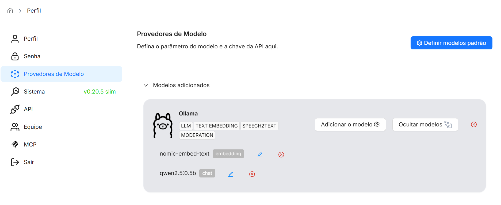

# ConsultAI Ufla Júnior

Trabalho Prático – Disciplina de Sistemas Distribuídos
Universidade Federal de Lavras (UFLA)

## DESCRIÇÃO DO PROJETO

O ConsultAI Ufla Júnior é uma aplicação inteligente desenvolvida para atender potenciais clientes da Ufla Júnior, empresa júnior de consultoria em administração.

O sistema tem como objetivo responder automaticamente dúvidas frequentes sobre os serviços de consultoria, utilizando uma base de dados própria e explorando conceitos de sistemas distribuídos e inteligência artificial.

## OBJETIVOS

- Criar um chatbot inteligente para interação com clientes da Ufla Júnior.

- Aplicar conceitos de Sistemas Distribuídos, como: Comunicação entre múltiplos agentes de IA.

- Fornecer respostas contextualizadas e consistentes com base em nossa base de conhecimento.


## ESTRUTURA DO PROJETO

O projeto terá a seguinte estrutura:

- Toda parte do frontend e backend da aplicação estará organizado na pasta [`ragflow_api`](./ragflow_api/)
- Toda documentação estará na pasta [`documentacao`](./documentacao/)
- A base de dados que projeto irá usar estará na pasta [`base_de_dados`](./base_de_dados/)

## DOCUMENTAÇÃO

Toda a análise empresarial, arquitetônica, modelagem de ameaças e estratégias de mitigação do sistema estão detalhadas nos seguintes documentos:

1.  **[Introdução](./documentacao/Introducao.md)**: Detalha o problema enfrentado pela UFLA JR e faz proposta de solução.
2.  **[Visão Arquitetônica Inicial](./documentacao/Arquitetura.md)**: Descreve a arquitetura funcional do sistema antes da análise de segurança.
3.  **[Modelagem de Ameaças](./documentacao/2_ModelagemAmeacas.md)**: Apresenta a análise de riscos e ameaças utilizando a metodologia STRIDE.
4.  **[Visão Arquitetônica Final](./documentacao/VisaoArquitetonicaFinal.md)**: Detalha a arquitetura aprimorada com os controles de segurança implementados


## TECNOLOGIAS UTILIZADAS

<table border="1" style="border-collapse: collapse; width: 100%;">
  <!-- Front-end -->
  <tr>
    <td style="padding: 8px; text-align: center;">
      
      
    </td>
    <td style="padding: 8px;">HTML5 & CSS3</td>
    <td style="padding: 8px;">Front-End</td>
  </tr>

  <!-- Back-end -->
  <tr>
    <td style="padding: 8px; text-align: center;">
      
    </td>
    <td style="padding: 8px;">Python 3.13</td>
    <td style="padding: 8px;">Back-End</td>
  </tr>

  <!-- FastAPI -->
  <tr>
    <td style="padding: 8px; text-align: center;">
      
    </td>
    <td style="padding: 8px;">FastAPI</td>
    <td style="padding: 8px;">API REST</td>
  </tr>

  <!-- Uvicorn -->
  <tr>
    <td style="padding: 8px; text-align: center;">
      
    </td>
    <td style="padding: 8px;">Uvicorn</td>
    <td style="padding: 8px;">ASGI Server</td>
  </tr>

  <!-- RAGFlow SDK -->
  <tr>
    <td style="padding: 8px; text-align: center;">
      
    </td>
    <td style="padding: 8px;">RAGFlow SDK</td>
    <td style="padding: 8px;">Integração com Assistente IA</td>
  </tr>

  <!-- Ollama -->
<tr>
  <td style="padding: 8px; text-align: center;">
    
  </td>
  <td style="padding: 8px;">Ollama</td>
  <td style="padding: 8px;">Execução local de modelos LLM</td>
</tr>

  <!-- Ambiente Virtual -->
  <tr>
    <td style="padding: 8px; text-align: center;">
      
    </td>
    <td style="padding: 8px;">Python venv</td>
    <td style="padding: 8px;">Ambiente Isolado</td>
  </tr>
</table>

## IAs UTILIZADAS

Para o funcionamento do **ConsultAI Ufla Júnior**, foram integradas as seguintes **IAs**, cada uma com **papéis específicos** dentro do sistema:

- **nomic-embed-text (conteinerizada):** responsável por gerar **embeddings da base de dados**, permitindo que o **RAGFlow** realize **buscas semânticas eficientes** e forneça **respostas precisas** a partir do **conhecimento armazenado**.

- **qwen2.5:0.5B (conteinerizado):** utilizado para **complementar informações não presentes na base de dados**, garantindo **respostas mais completas** e **contextualmente relevantes** aos usuários.


<p align="center">  </p>

## RODANDO O PROJETO:

```bash
### 1. Clone o repositório

git clone git@github.com:juliaaribeiro/Sistemas-Distribu-dos.git
cd Sistemas-Distribu-dos

#2. Crie um ambiente virtual

python -m venv venv
venv\Scripts\activate     # Windows
source venv/bin/activate  # Linux/macOS

#3. Instale as dependências

pip install -r requirements.txt

#4. Ajuste as variáveis de ambiente
#Remova o .exmaple do .env e altere os valores das variáveis

API_KEY = "ragflow-..."       # sua chave de API da RAGFlow
BASE_URL = "http://localhost"   # base URL do servidor RAGFlow
CHAT_ID = "ID"      # id do assistente configurado


#5. Executando o servidor

cd ragflow_api
uvicorn backend:app --reload

Abra index.html no navegador para interagir com o chatbot.


```
## REFERÊNCIAS

1. **FastAPI**  
   Tiangolo, S. (2023). *FastAPI: The modern, fast (high-performance), web framework for building APIs with Python 3.6+ based on standard Python type hints*. Disponível em: [https://fastapi.tiangolo.com/](https://fastapi.tiangolo.com/)

2. **Uvicorn**  
   Tom Christie et al. (2023). *Uvicorn: The lightning-fast ASGI server implementation, using uvloop and httptools*. Disponível em: [https://www.uvicorn.org/](https://www.uvicorn.org/)

3. **RAGFlow SDK**  
   MarkTechPost (2024). *RAGFlow: SDK para integração com assistentes de IA e processamento de linguagem natural*. Disponível em: [https://github.com/infiniflow/ragflow](https://github.com/infiniflow/ragflow)

4. **Ollama**  
   Ollama, Inc. (2024). *Ollama: Execução local de modelos LLM para inteligência artificial de linguagem*. Disponível em: [https://ollama.com/](https://ollama.com/)

## Equipe de Desenvolvimento
Gabriela Ribeiro

  - [Júlia Ribeiro](https://github.com/juliaaribeiro)

  - [Larissa Rocha](https://github.com/lari030)
